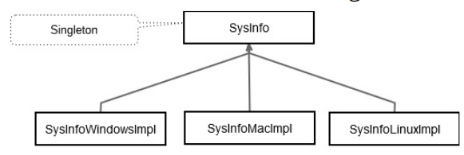

## QT创建跨平台项目示例(Windows/macOS/Linux)

以下将通过一个说明系统CPU和内存使用情况的程序,来解析跨平台项目的简单实现

为了完成这项任务，我们用到了俩种设计模式：
  * 策略模式：这是一个描述功能的接口，它的实现将会在子类中实现
  * 单例模式：保证一个类只有一个实例

### 类的设计

以下为类关系图：



创建SysInfo抽象类:

```
// in SysInfo.h
class SysInfo
{
public:
    static SysInfo& instance(); // static类全局对象，返回唯一实例
    virtual ~SysInfo();
    virtual void init()=0;
    virtual double memoryUsed()=0;
    virtual double cpuLoadAverage()=0;
protected: // 单例模式，只有本身和子类可见
    explicit SysInfo(); 
private:
    SysInfo(const SysInfo& rhs);
    SysInfo& operator=(const SysInfo& rhs);// 单例模式下复制和赋值是多余的
};

// in SysInfo.cpp
#include<QtGlobal>
#ifdef Q_OS_WIN
    #include"sysinfowindows.h"
#elif defined(Q_OS_MAC)
    #include "sysinfomac.h"
#elif defined(Q_OS_LINUX)
    #include "sysinfolinux.h"
#endif
SysInfo& SysInfo::instance(){
#ifdef Q_OS_WIN
    static SysInfoWindows singleton;
#elif defined(Q_OS_MAC)
    static SysInfoMac singleton;
#elif defined(Q_OS_LINUX)
    static SysInfoLinux singleton;
#endif
    return singleton;
}
SysInfo::SysInfo()
{

}
SysInfo::~SysInfo(){
}
```

分别创建在windows、mac、linux上的实现类SysInfoWindows、SysInfoMac、SysInfoLinux类，这里就不详述了
