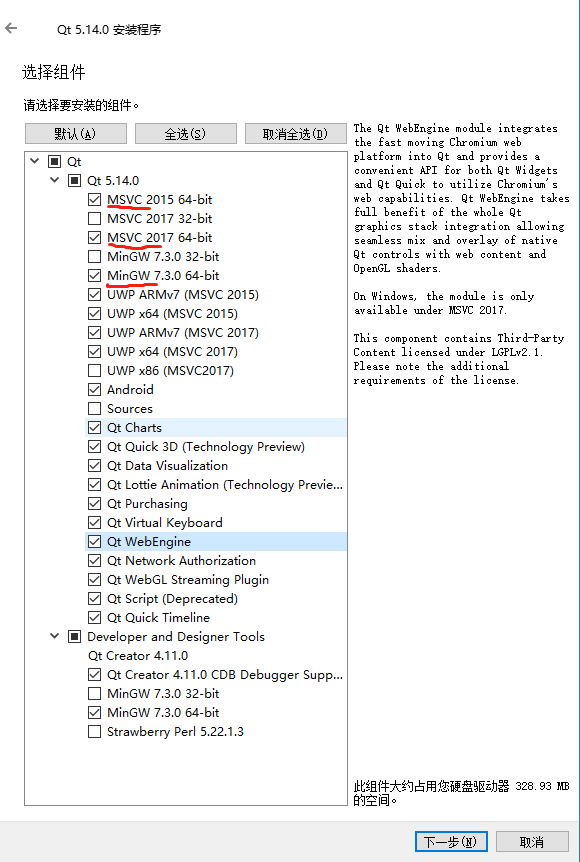
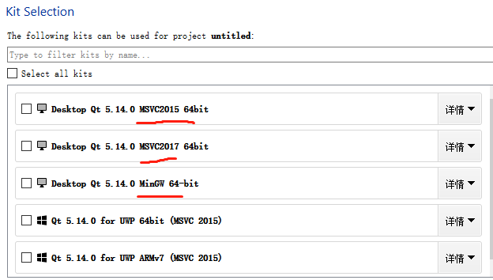

## 安装

安装时msvc一定要勾选，因为若是build时选择mingw,在使用windeployqt.exe打包时会一直报: Unable to Find platform plugin (到QT5.14版本时仍存在这个问题),如下图

## 新建项目

### kit选择

必须选择msvc来编译；若是选择mingw，在使用windeployqt.exe打包时会一直报: Unable to Find platform plugin (到QT5.14版本时仍存在这个问题),如下图

## 生成可执行文件

### 生成exe文件，并打包

1、 QtCreator 左下角改相应版本debug为release

2、 设置构建目录，F5运行

3、 $ cd F:\Qt\Qt5.14.0\5.14.0\msvc2015_64\bin   // 这是windeployqt.exe 所在目录

4、 $ windeployqt.exe E:\QT\chartthemes\chart.exe // 打包指定路径的exe文件

## 使用VSCODE 开发编译QT

点击 ctrl+shift+p 打开，c++UI配置

### 添加includePath

将QT相关头文件路径添加至includePath,如：

${env:QTMINGW} 为环境变量QTMINGW的值,如 F:\Qt\Qt5.14.0\5.14.0\mingw73_64\include

当然也可以用MSVC的inclue包

目录下放置的是QT相关头文件

### 添加浏览路径

